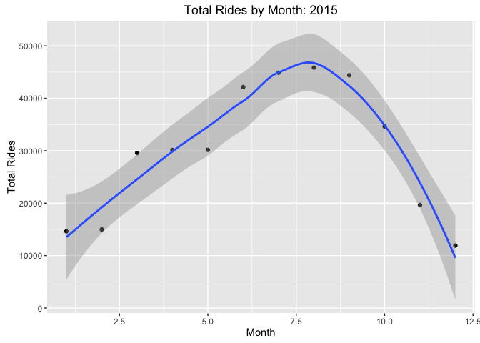
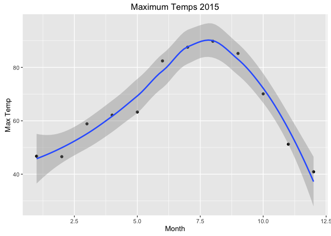
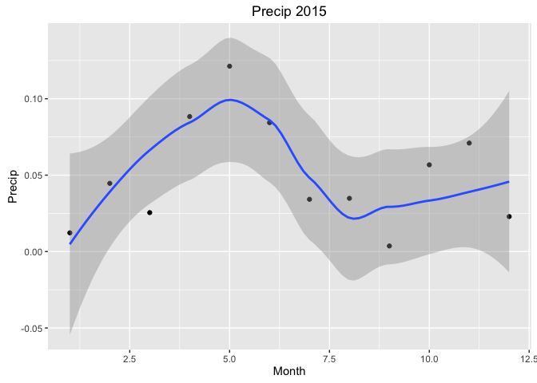
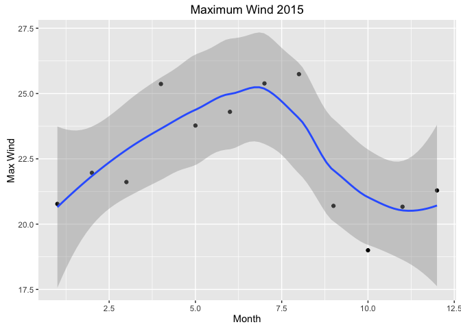
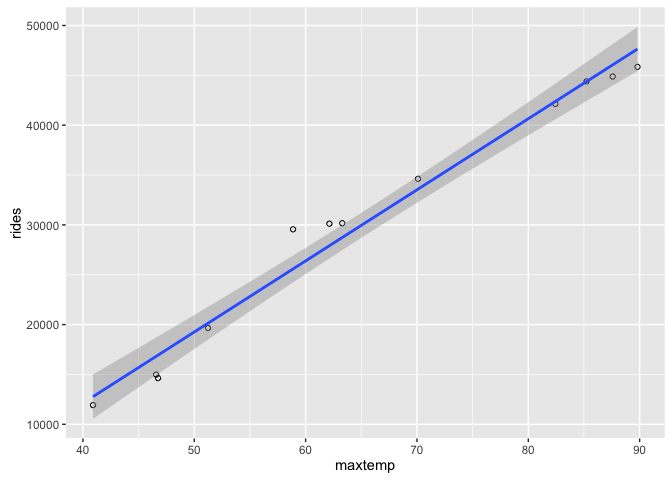
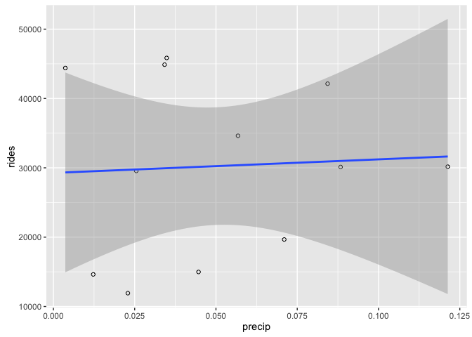
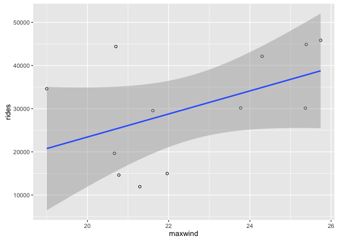
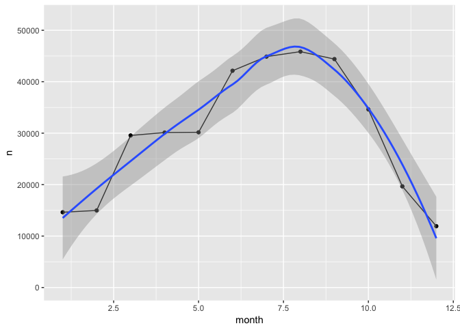
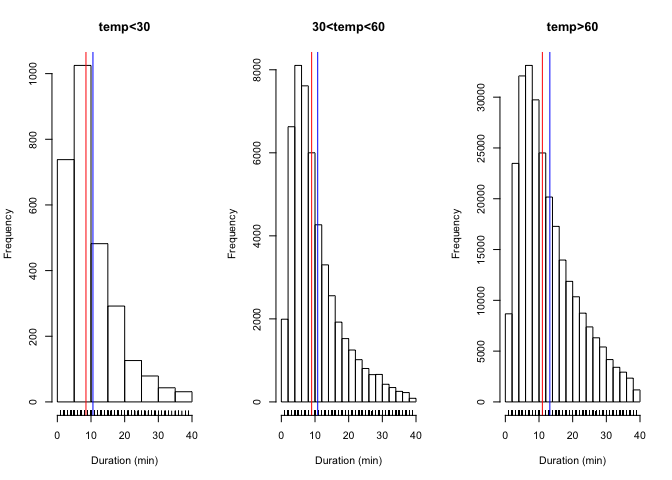

# How Does Weather Affect Denver Bcycle Usage?
Andy Pickering  
May 18, 2016  

## 


```r
rm(list=ls())
setwd("/Users/Andy/Bcycle/")
library(ggplot2)
library(lubridate)
```

```
## 
## Attaching package: 'lubridate'
```

```
## The following object is masked from 'package:base':
## 
##     date
```

First read in the data, which I have downloaded already from <https://denver.bcycle.com/company>.

```r
bcyc<-read.csv("Bcyc2015.csv")
head(bcyc)
```

```
##   User.s.Program User.ID   Zip              Membership.Type Bike
## 1 Denver B-cycle  253201 80202      Annual (Denver B-cycle)  212
## 2 Denver B-cycle  120679 80209      Annual (Denver B-cycle)    9
## 3 Denver B-cycle 1027135 60439      Annual (Denver B-cycle)  322
## 4 Denver B-cycle  986934 80203 Annual Plus (Denver B-cycle)  482
## 5 Denver B-cycle  130156 80204      Annual (Denver B-cycle)  466
## 6 Denver B-cycle 1051678 80211     24-hour (Denver B-cycle)  611
##   Checkout.Date Checkout.Time      Checkout.Kiosk Return.Date Return.Time
## 1      12/31/15   11:51:00 PM        32nd & Pecos    12/31/15 11:57:00 PM
## 2      12/31/15   11:29:00 PM     18th & Arapahoe    12/31/15 11:35:00 PM
## 3      12/31/15   10:50:00 PM     16th & Broadway    12/31/15 10:59:00 PM
## 4      12/31/15   10:41:00 PM 22nd & Pennsylvania    12/31/15 10:49:00 PM
## 5      12/31/15    9:38:00 PM      9th & Santa Fe    12/31/15  9:48:00 PM
## 6      12/31/15    9:18:00 PM 16th & Little Raven    12/31/15  9:32:00 PM
##        Return.Kiosk Duration..Minutes.
## 1    15th & Delgany                  6
## 2   25th & Lawrence                  6
## 3       17th & Race                  9
## 4   33rd & Arapahoe                  8
## 5    1st & Broadway                 10
## 6 Broadway & Walnut                 14
```

How many rides are contained in this dataset?

```r
nr<-nrow(bcyc)
```

So we have 363002 observations (rides) in this dataset.


```r
# add a new column of class Posixct with date/time comined
bcyc$dt_chkout<-as.POSIXct( strptime(paste(bcyc$Checkout.Date,bcyc$Checkout.Time),"%m/%d/%y %H:%M:%S"))
bcyc$dt_ret<-as.POSIXct( strptime(paste(bcyc$Return.Date,bcyc$Return.Time),"%m/%d/%y %H:%M:%S"))
```


## Now I want to compute the total rides per month and see what kind of seasonal cycle there is.

```r
# List of months
month_list <- c("January","February","March","April","May","June","July","August","September","October","November","December")
bcyc$month <- months(bcyc$dt_chkout)
tot_rides_month <- vector(mode='numeric',length=12)

for (i in seq_along(month_list)){
        a<-which(bcyc$month==month_list[i])
        tot_rides_month[i] <- length(a)
}

# Make a new dataframe w/ monthy rides
bcyc_monthly <- data.frame(rides=tot_rides_month,month=month_list,monthID=1:12)

# Plot rides per month vs. month
qplot(bcyc_monthly$monthID,bcyc_monthly$rides,xlab="Month",ylab="Total Rides",main="Total Rides by Month: 2015",geom=c("point","smooth"))
```

<!-- -->
  
So we can see that the total rides peaks around August, and is lowest around December. This is probably related to the weather, let's get some weather data and check this out. I'm using data downloaded from <www.wunderground.com>.


```r
# daily for 1 year
url<-"https://www.wunderground.com/history/airport/KDEN/2015/1/1/CustomHistory.html?dayend=31&monthend=12&yearend=2015&req_city=&req_state=&req_statename=&reqdb.zip=&reqdb.magic=&reqdb.wmo=&format=1"

download.file(url,"DenWeather2015.csv")

wea<-read.csv("DenWeather2015.csv")
wea$MST <- as.Date(wea$MST,"%Y-%m-%d")
wea$month <- months(wea$MST)

# in Precip "T" is trace I think; change to zero for analysis
idT<-which(wea$PrecipitationIn=="T")
wea$PrecipitationIn[idT]<-"0.00"
wea$PrecipitationIn <- as.numeric(as.character(wea$PrecipitationIn))

# compute mean weather values per month
maxtemp_mean_month <- vector(mode='numeric',length=12)
mintemp_mean_month <- vector(mode='numeric',length=12)
precip_mean_month <- vector(mode='numeric',length=12)
maxwind_mean_month <- vector(mode='numeric',length=12)

for (i in seq_along(month_list)){
        a<-which(wea$month==month_list[i])
        maxtemp_mean_month[i] <- mean(wea$Max.TemperatureF[a])
        mintemp_mean_month[i] <- mean(wea$Min.TemperatureF[a],na.rm = TRUE)
        precip_mean_month[i] <- mean(wea$PrecipitationIn[a],na.rm = TRUE)
        maxwind_mean_month[i] <- mean(wea$Max.Wind.SpeedMPH[a],na.rm = TRUE)
}

# Make a data frame w/ monthly values
W_mon=data.frame(precip=precip_mean_month,maxtemp=maxtemp_mean_month,mintemp=mintemp_mean_month,maxwind=maxwind_mean_month,monthID=1:12,month=month_list)


qplot(W_mon$monthID,W_mon$maxtemp,geom=c("point","smooth"),xlab="Month",ylab="Max Temp",main="Maximum Temps 2015")
```

<!-- -->

```r
qplot(W_mon$monthID,W_mon$precip,geom=c("point","smooth"),xlab="Month",ylab="Precip",main="Precip 2015")
```

<!-- -->

```r
qplot(W_mon$monthID,W_mon$maxwind,geom=c("point","smooth"),xlab="Month",ylab="Max Wind",main="Maximum Wind 2015")
```

<!-- -->

## The MaxTemp seasonal cycle looks very similar to the month ride totals. Let's make some scatterplots to better see the correlation between weather variables and the number of rides.


```r
month_merge<-merge(bcyc_monthly,W_mon)
ggplot(dat=month_merge,aes(x=maxtemp,y=rides))+geom_point(shape=1)+geom_smooth(method=lm)
```

<!-- -->

```r
ggplot(dat=month_merge,aes(x=precip,y=rides))+geom_point(shape=1)+geom_smooth(method=lm)
```

<!-- -->

```r
ggplot(dat=month_merge,aes(x=maxwind,y=rides))+geom_point(shape=1)+geom_smooth(method=lm)
```

<!-- -->


## Let's look in a little more detail at the daily level.


```r
bcyc$yday <- yday(bcyc$dt_chkout)
uniq_yday <- sort(unique(bcyc$yday))

# Make an empty vector to store results in
tot_rides_daily <- vector(mode="numeric",length=length(uniq_yday))

for (i in seq_along(uniq_yday)) {
        rm(a)
        a<-which(bcyc$yday==uniq_yday[i])
        tot_rides_daily[i] <- length(a)
}

qplot(uniq_yday,tot_rides_daily,xlab="Yearday",ylab="Total Rides",main="Daily total rides",geom=c("point","smooth"))
```

<!-- -->

At the daily level, the seasonal pattern is the same but there is a lot more variability, especially in the winter/spring.  
  
  Let's look at the relationship between daily temperature and rides.


```r
qplot(wea$Max.TemperatureF,tot_rides_daily,xlab="Max Temp",ylab="Total Rides",main="Daily total rides vs Temp",geom=c("point","smooth"))
```

<!-- -->

## Look at how ride durations change w/ temperature.


```r
# Need to add the daily temp to each bcyc ride
for (i in seq_along(yday(wea$MST))){
        ig<-which(bcyc$yday == yday(wea$MST)[i])
        bcyc$temp[ig]<-wea$Max.TemperatureF[i]
}


tlim<-40
par(mfrow=c(1,3))
ig <- which(bcyc$temp<30 & bcyc$Duration..Minutes.<tlim)
hist(bcyc$Duration..Minutes.[ig],main="temp<30",xlab="Duration (min)")
rug(bcyc$Duration..Minutes.[ig])
abline(v=median(bcyc$Duration..Minutes.[ig]),col="red")
abline(v=mean(bcyc$Duration..Minutes.[ig]),col="blue")

ig <- which(bcyc$temp>30 & bcyc$temp<60 & bcyc$Duration..Minutes.<tlim)
hist(bcyc$Duration..Minutes.[ig],main="30<temp<60",xlab="Duration (min)")
rug(bcyc$Duration..Minutes.[ig])
abline(v=median(bcyc$Duration..Minutes.[ig]),col="red")
abline(v=mean(bcyc$Duration..Minutes.[ig]),col="blue")

ig <- which( bcyc$temp>60 & bcyc$Duration..Minutes.<tlim)
hist(bcyc$Duration..Minutes.[ig],main="temp>60",xlab="Duration (min)")
rug(bcyc$Duration..Minutes.[ig])
abline(v=median(bcyc$Duration..Minutes.[ig]),col="red")
abline(v=mean(bcyc$Duration..Minutes.[ig]),col="blue")
```

<!-- -->


#Conclusions:  
- The total number of Denver Bcycle rides has a strong seasonal cycle, peaking around August and minimum around January.  
- The total number of Denver Bcycle rides per month is strongly correlated with the monthly mean of max temperatures.  
- Below about 30 deg and above 80 deg, the number of rides is less dependent on further decreasing(increasing) temperature.  
- The mean and median ride durations tend to be larger for increasing temperatures.  

# Follow-up Questions:  
- Do all years look the same?  
- Does the relationship between weather and rides look different for different types of passes (ie annual vs 24 hour)?  
- Is there a stronger correlation with precip on shorter timescales (hourly?)?

