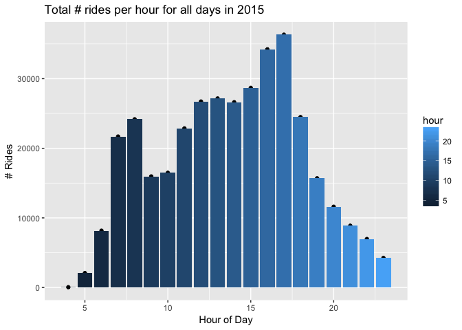
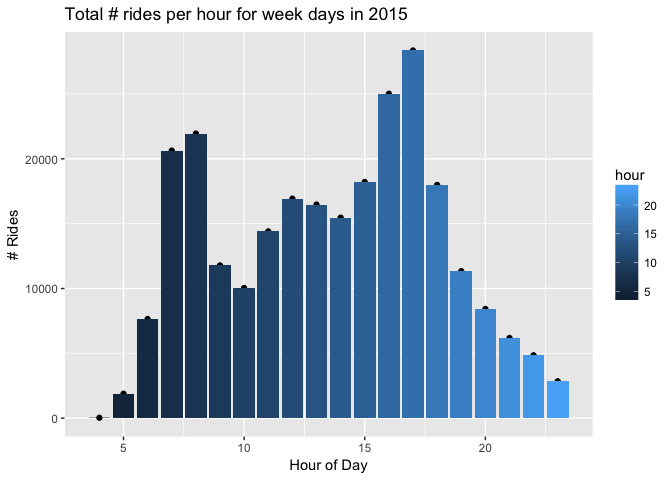
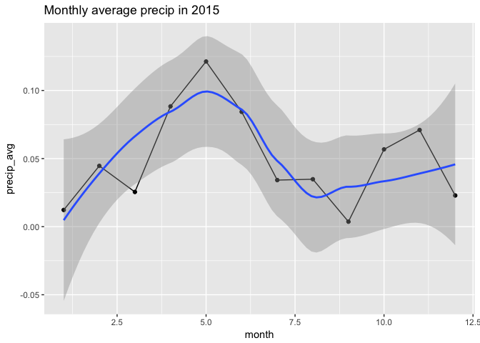

# How Does Weather Affect Denver Bcycle Usage?
Andy Pickering  
Aug 1, 2017  

## Introduction

This is an analysis looking at bike share ('BCycle') usage in Denver, CO, and the effect of weather. This was originally done in ?2016 . I am now (Aug 2017) re-visiting the analysis and updating code. I was just learning R at the time of the original analysis, so i'm updating and extending the analysis with my improved R skills. This project is maintained ina github repo at - <https://github.com/andypicke/Bcycle>
.

## Clear workspace and load libraries we'll use in the analysis

```r
rm(list=ls())
library(ggplot2)
suppressPackageStartupMessages(library(lubridate))
suppressPackageStartupMessages(library(dplyr))
```


## Bcycle Data

First read in the data for 2015, which I have downloaded already from <https://denver.bcycle.com/company>. Note: I tried to read in the xlsx file using the 'xlsx' package, but it didn't work. Instead I just opened excel and saved the file as a csv.


```r
bcyc<-read.csv("data/Bcyc2015.csv")
head(bcyc)
```

```
##   User.s.Program User.ID   Zip              Membership.Type Bike
## 1 Denver B-cycle  253201 80202      Annual (Denver B-cycle)  212
## 2 Denver B-cycle  120679 80209      Annual (Denver B-cycle)    9
## 3 Denver B-cycle 1027135 60439      Annual (Denver B-cycle)  322
## 4 Denver B-cycle  986934 80203 Annual Plus (Denver B-cycle)  482
## 5 Denver B-cycle  130156 80204      Annual (Denver B-cycle)  466
## 6 Denver B-cycle 1051678 80211     24-hour (Denver B-cycle)  611
##   Checkout.Date Checkout.Time      Checkout.Kiosk Return.Date Return.Time
## 1      12/31/15   11:51:00 PM        32nd & Pecos    12/31/15 11:57:00 PM
## 2      12/31/15   11:29:00 PM     18th & Arapahoe    12/31/15 11:35:00 PM
## 3      12/31/15   10:50:00 PM     16th & Broadway    12/31/15 10:59:00 PM
## 4      12/31/15   10:41:00 PM 22nd & Pennsylvania    12/31/15 10:49:00 PM
## 5      12/31/15    9:38:00 PM      9th & Santa Fe    12/31/15  9:48:00 PM
## 6      12/31/15    9:18:00 PM 16th & Little Raven    12/31/15  9:32:00 PM
##        Return.Kiosk Duration..Minutes.
## 1    15th & Delgany                  6
## 2   25th & Lawrence                  6
## 3       17th & Race                  9
## 4   33rd & Arapahoe                  8
## 5    1st & Broadway                 10
## 6 Broadway & Walnut                 14
```


### Take a look at structure of the data
- dates/times are Factor type and need to be converted
- 

```r
str(bcyc)
```

```
## 'data.frame':	363002 obs. of  12 variables:
##  $ User.s.Program    : Factor w/ 18 levels "ArborBike","Austin B-cycle",..: 6 6 6 6 6 6 6 6 7 3 ...
##  $ User.ID           : int  253201 120679 1027135 986934 130156 1051678 313863 395197 253997 254005 ...
##  $ Zip               : Factor w/ 7820 levels "","0","1","10000",..: 5767 5774 4044 5768 5769 5777 5770 5796 5777 5777 ...
##  $ Membership.Type   : Factor w/ 26 levels "24-hour (Denver B-cycle)",..: 6 6 6 21 6 1 21 6 7 26 ...
##  $ Bike              : Factor w/ 743 levels "10","100","101",..: 105 697 208 360 346 489 103 479 74 446 ...
##  $ Checkout.Date     : Factor w/ 365 levels "1/1/15","1/10/15",..: 117 117 117 117 117 117 117 117 117 117 ...
##  $ Checkout.Time     : Factor w/ 1144 levels "1:00:00 PM","1:01:00 PM",..: 284 240 162 144 1102 1062 1050 1048 1046 1046 ...
##  $ Checkout.Kiosk    : Factor w/ 87 levels "10th & Osage",..: 50 34 22 43 60 23 45 38 23 23 ...
##  $ Return.Date       : Factor w/ 366 levels "1/1/15","1/1/16",..: 118 118 118 118 118 118 118 2 118 118 ...
##  $ Return.Time       : Factor w/ 1323 levels "1:00:00 AM","1:00:00 PM",..: 351 307 235 215 1301 1269 1237 1038 1231 1231 ...
##  $ Return.Kiosk      : Factor w/ 92 levels "10th & Osage",..: 20 45 32 51 39 63 51 38 24 24 ...
##  $ Duration..Minutes.: int  6 6 9 8 10 14 4 626 3 3 ...
```


### Modifications:
- make column names lowercase
- remove periods and spaces in column anmes
- shorten some names
- Convert dates/times to appropriate data types


```r
names(bcyc) <- names(bcyc) %>%
        tolower() %>%
        stringr::str_replace_all('[.]','_')
head(bcyc)
```

```
##   user_s_program user_id   zip              membership_type bike
## 1 Denver B-cycle  253201 80202      Annual (Denver B-cycle)  212
## 2 Denver B-cycle  120679 80209      Annual (Denver B-cycle)    9
## 3 Denver B-cycle 1027135 60439      Annual (Denver B-cycle)  322
## 4 Denver B-cycle  986934 80203 Annual Plus (Denver B-cycle)  482
## 5 Denver B-cycle  130156 80204      Annual (Denver B-cycle)  466
## 6 Denver B-cycle 1051678 80211     24-hour (Denver B-cycle)  611
##   checkout_date checkout_time      checkout_kiosk return_date return_time
## 1      12/31/15   11:51:00 PM        32nd & Pecos    12/31/15 11:57:00 PM
## 2      12/31/15   11:29:00 PM     18th & Arapahoe    12/31/15 11:35:00 PM
## 3      12/31/15   10:50:00 PM     16th & Broadway    12/31/15 10:59:00 PM
## 4      12/31/15   10:41:00 PM 22nd & Pennsylvania    12/31/15 10:49:00 PM
## 5      12/31/15    9:38:00 PM      9th & Santa Fe    12/31/15  9:48:00 PM
## 6      12/31/15    9:18:00 PM 16th & Little Raven    12/31/15  9:32:00 PM
##        return_kiosk duration__minutes_
## 1    15th & Delgany                  6
## 2   25th & Lawrence                  6
## 3       17th & Race                  9
## 4   33rd & Arapahoe                  8
## 5    1st & Broadway                 10
## 6 Broadway & Walnut                 14
```


```r
bcyc$checkout_date <- lubridate::as_date(as.character(bcyc$checkout_date),'%m/%d/%y')
bcyc$return_date  <- lubridate::as_date(as.character(bcyc$return_date),'%m/%d/%y')
bcyc$return_time <- lubridate::parse_date_time(as.character(bcyc$return_time),'%I:%M:%S %p')
bcyc$checkout_time <- lubridate::parse_date_time(as.character(bcyc$checkout_time),'%I:%M:%S %p')
str(bcyc)
```

```
## 'data.frame':	363002 obs. of  12 variables:
##  $ user_s_program    : Factor w/ 18 levels "ArborBike","Austin B-cycle",..: 6 6 6 6 6 6 6 6 7 3 ...
##  $ user_id           : int  253201 120679 1027135 986934 130156 1051678 313863 395197 253997 254005 ...
##  $ zip               : Factor w/ 7820 levels "","0","1","10000",..: 5767 5774 4044 5768 5769 5777 5770 5796 5777 5777 ...
##  $ membership_type   : Factor w/ 26 levels "24-hour (Denver B-cycle)",..: 6 6 6 21 6 1 21 6 7 26 ...
##  $ bike              : Factor w/ 743 levels "10","100","101",..: 105 697 208 360 346 489 103 479 74 446 ...
##  $ checkout_date     : Date, format: "2015-12-31" "2015-12-31" ...
##  $ checkout_time     : POSIXct, format: "0000-01-01 23:51:00" "0000-01-01 23:29:00" ...
##  $ checkout_kiosk    : Factor w/ 87 levels "10th & Osage",..: 50 34 22 43 60 23 45 38 23 23 ...
##  $ return_date       : Date, format: "2015-12-31" "2015-12-31" ...
##  $ return_time       : POSIXct, format: "0000-01-01 23:57:00" "0000-01-01 23:35:00" ...
##  $ return_kiosk      : Factor w/ 92 levels "10th & Osage",..: 20 45 32 51 39 63 51 38 24 24 ...
##  $ duration__minutes_: int  6 6 9 8 10 14 4 626 3 3 ...
```


```r
bcyc$month <- lubridate::month(bcyc$checkout_date)
bcyc$yday <- lubridate::yday(bcyc$checkout_date)
bcyc <- arrange(bcyc,yday)
head(bcyc)
```

```
##   user_s_program user_id   zip         membership_type bike checkout_date
## 1 Denver B-cycle  560257 80296 Annual (Denver B-cycle)   43    2015-01-01
## 2 Denver B-cycle  394497 80012 Annual (Denver B-cycle)  178    2015-01-01
## 3 Denver B-cycle  431966 80209 Annual (Denver B-cycle)  519    2015-01-01
## 4 Denver B-cycle  439411 80203 Annual (Denver B-cycle)  221    2015-01-01
## 5 Denver B-cycle  615015 80203 Annual (Denver B-cycle)  263    2015-01-01
## 6 Denver B-cycle  212129                Not Applicable  574    2015-01-01
##         checkout_time  checkout_kiosk return_date         return_time
## 1 0000-01-01 21:42:00 3rd & Milwaukee  2015-01-01 0000-01-01 21:54:00
## 2 0000-01-01 20:50:00  15th & Delgany  2015-01-01 0000-01-01 20:55:00
## 3 0000-01-01 18:15:00    19th & Pearl  2015-01-01 0000-01-01 18:34:00
## 4 0000-01-01 18:03:00    1350 Larimer  2015-01-01 0000-01-01 18:14:00
## 5 0000-01-01 17:08:00  1st & Broadway  2015-01-01 0000-01-01 17:28:00
## 6 0000-01-01 16:02:00     Five Points  2015-01-01 0000-01-01 16:15:00
##              return_kiosk duration__minutes_ month yday
## 1        12th & Columbine                 12     1    1
## 2           16th & Platte                  5     1    1
## 3            19th & Pearl                 19     1    1
## 4            17th & Pearl                 11     1    1
## 5      Colfax & Columbine                 20     1    1
## 6 Park Ave West & Tremont                 13     1    1
```


```r
# add a new column of class Posixct with date/time comined
#bcyc$dt_chkout<-as.POSIXct( strptime(paste(bcyc$Checkout.Date,bcyc$Checkout.Time),"%m/%d/%y %H:%M:%S"))
#bcyc$dt_ret<-as.POSIXct( strptime(paste(bcyc$Return.Date,bcyc$Return.Time),"%m/%d/%y %H:%M:%S"))
#bcyc$month <- month(bcyc$dt_chkout)
```


How many rides (rows) are contained in this dataset?

```r
nr<-nrow(bcyc)
nr
```

```
## [1] 363002
```


### How many missing values are there?


### Group by month and plot total # rides

```r
bcyc %>% group_by(month) %>%
        count() %>% 
        ggplot(aes(x=month,y=n)) +
        geom_point() + 
        geom_line() + 
        geom_smooth() +
        xlab("Month") + ylab('# Rides') + 
        ggtitle("Monthly Number of Bcycle rides in 2015")
```

```
## `geom_smooth()` using method = 'loess'
```

<!-- -->


### Group by yday and plot total # rides

```r
bcyc %>% group_by(yday) %>% 
        count() %>% 
        ggplot(aes(x=yday,y=n)) +
        geom_point() + geom_smooth() + 
        xlab("yday") + ylab('# Rides') + 
        ggtitle("Daily Number of Bcycle rides in 2015")
```

```
## `geom_smooth()` using method = 'loess'
```

<!-- -->


### Plot number rides by wkday

```r
bcyc$wkday <- lubridate::wday(bcyc$checkout_date,label=TRUE)
#head(bcyc)
bcyc %>% 
        group_by(wkday) %>%
        count() %>%
        ggplot(aes(wkday,n))+
        geom_point() +
        geom_bar(stat='Identity',aes(fill=wkday))
```

<!-- -->

### Plot number rides by hour


```r
bcyc$hour <- hour(bcyc$checkout_time)
#head(bcyc)
bcyc %>% 
        group_by(hour) %>%
        count() %>%
        ggplot(aes(hour,n))+
        geom_point() +
        geom_bar(stat='Identity',aes(fill=hour)) +
        xlab('Hour of Day') +
        ylab('# Rides') +
        ggtitle("Total # rides per hour for all days in 2015")
```

<!-- -->


## Weather Data
So we can see that the total rides peaks around August, and is lowest around December. This is probably related to the weather, let's get some weather data and check this out. I'm using data downloaded from <https://www.wunderground.com>.


```r
# Daily weather data for 2015
url<-"https://www.wunderground.com/history/airport/KDEN/2015/1/1/CustomHistory.html?dayend=31&monthend=12&yearend=2015&req_city=&req_state=&req_statename=&reqdb.zip=&reqdb.magic=&reqdb.wmo=&format=1"

download.file(url,"DenWeather2015.csv")
wea<-read.csv("DenWeather2015.csv")

wea$MST <- as.Date(wea$MST,"%Y-%m-%d")
wea$month <- month(wea$MS)

# in Precip "T" is trace I think; change to zero for analysis
idT<-which(wea$PrecipitationIn=="T")
wea$PrecipitationIn[idT]<-"0.00"
wea$PrecipitationIn <- as.numeric(as.character(wea$PrecipitationIn))

head(wea)
```

```
##          MST Max.TemperatureF Mean.TemperatureF Min.TemperatureF
## 1 2015-01-01               26                16                5
## 2 2015-01-02               35                23               11
## 3 2015-01-03               35                15               -5
## 4 2015-01-04               36                13              -10
## 5 2015-01-05               56                26               -5
## 6 2015-01-06               49                35               20
##   Max.Dew.PointF MeanDew.PointF Min.DewpointF Max.Humidity Mean.Humidity
## 1             19              9            -8           92            67
## 2             22             14             9           96            79
## 3             25             11            -7           92            77
## 4             13              2           -13           91            65
## 5             34             20            -6           95            67
## 6             36             29            19           92            73
##   Min.Humidity Max.Sea.Level.PressureIn Mean.Sea.Level.PressureIn
## 1           42                    30.22                     30.13
## 2           61                    30.17                     30.02
## 3           61                    30.40                     30.05
## 4           38                    30.51                     30.42
## 5           38                    30.53                     30.17
## 6           53                    30.64                     30.35
##   Min.Sea.Level.PressureIn Max.VisibilityMiles Mean.VisibilityMiles
## 1                    29.99                  10                    6
## 2                    29.79                  10                   10
## 3                    29.79                  10                    6
## 4                    30.20                  10                   10
## 5                    29.99                  10                    9
## 6                    30.22                  10                    8
##   Min.VisibilityMiles Max.Wind.SpeedMPH Mean.Wind.SpeedMPH
## 1                   0                15                  8
## 2                   7                17                 10
## 3                   0                32                 12
## 4                   6                15                  7
## 5                   4                37                 15
## 6                   0                30                  9
##   Max.Gust.SpeedMPH PrecipitationIn CloudCover   Events
## 1                18            0.08          5 Fog-Snow
## 2                22            0.00          2         
## 3                37            0.08          6 Fog-Snow
## 4                19            0.00          5         
## 5                46            0.00          5         
## 6                39            0.00          6 Fog-Snow
##   WindDirDegrees.br... month
## 1            230<br />     1
## 2            203<br />     1
## 3             47<br />     1
## 4            221<br />     1
## 5            278<br />     1
## 6             81<br />     1
```


```r
names(wea) <- names(wea) %>%
        tolower() %>%
        stringr::str_replace_all('[.]','_')
wea <- wea %>%
        rename(max_temp=max_temperaturef,
               mean_temp=mean_temperaturef,
               min_temp=min_temperaturef,
               max_dew=max_dew_pointf,
               mean_dw=meandew_pointf,
               min_dew=min_dewpointf,
               wind_dir = winddirdegrees_br___)
head(wea)
```

```
##          mst max_temp mean_temp min_temp max_dew mean_dw min_dew
## 1 2015-01-01       26        16        5      19       9      -8
## 2 2015-01-02       35        23       11      22      14       9
## 3 2015-01-03       35        15       -5      25      11      -7
## 4 2015-01-04       36        13      -10      13       2     -13
## 5 2015-01-05       56        26       -5      34      20      -6
## 6 2015-01-06       49        35       20      36      29      19
##   max_humidity mean_humidity min_humidity max_sea_level_pressurein
## 1           92            67           42                    30.22
## 2           96            79           61                    30.17
## 3           92            77           61                    30.40
## 4           91            65           38                    30.51
## 5           95            67           38                    30.53
## 6           92            73           53                    30.64
##   mean_sea_level_pressurein min_sea_level_pressurein max_visibilitymiles
## 1                     30.13                    29.99                  10
## 2                     30.02                    29.79                  10
## 3                     30.05                    29.79                  10
## 4                     30.42                    30.20                  10
## 5                     30.17                    29.99                  10
## 6                     30.35                    30.22                  10
##   mean_visibilitymiles min_visibilitymiles max_wind_speedmph
## 1                    6                   0                15
## 2                   10                   7                17
## 3                    6                   0                32
## 4                   10                   6                15
## 5                    9                   4                37
## 6                    8                   0                30
##   mean_wind_speedmph max_gust_speedmph precipitationin cloudcover   events
## 1                  8                18            0.08          5 Fog-Snow
## 2                 10                22            0.00          2         
## 3                 12                37            0.08          6 Fog-Snow
## 4                  7                19            0.00          5         
## 5                 15                46            0.00          5         
## 6                  9                39            0.00          6 Fog-Snow
##    wind_dir month
## 1 230<br />     1
## 2 203<br />     1
## 3  47<br />     1
## 4 221<br />     1
## 5 278<br />     1
## 6  81<br />     1
```


```r
wea %>% group_by(month) %>% 
        summarise(Tavg = mean(mean_temp)) %>% 
        ggplot(aes(x=month,y=Tavg)) + 
        geom_point() + 
        geom_line() + 
        geom_smooth() +
        ggtitle('Monthly average temperature in 2015')
```

```
## `geom_smooth()` using method = 'loess'
```

<!-- -->


```r
wea %>% group_by(month) %>% 
        summarise(hum_avg = mean(mean_humidity)) %>% 
        ggplot(aes(x=month,y=hum_avg)) + 
        geom_point() + 
        geom_line() + 
        geom_smooth() +
        ggtitle('Monthly average humidity in 2015')
```

```
## `geom_smooth()` using method = 'loess'
```

<!-- -->


```r
wea %>% group_by(month) %>% 
        summarise(precip_avg = mean(precipitationin)) %>% 
        ggplot(aes(x=month,y=precip_avg)) + 
        geom_point() + 
        geom_line() + 
        geom_smooth() +
        ggtitle('Monthly average precip in 2015')
```

```
## `geom_smooth()` using method = 'loess'
```

<!-- -->


## Comparison of weather and Bcycle data 
- The MaxTemp seasonal cycle looks very similar to the month ride totals. Let's make some scatterplots to better see the correlation between weather variables and the number of rides.


### Monthly
- Make new data frames grouped by month


```r
bcyc_monthly <- bcyc %>% 
        group_by(month) %>% 
        count()

wea_monthly  <- wea %>% 
        group_by(month) %>% 
        summarise(tavg=mean(mean_temp,na.rm=TRUE),
        precip_avg=mean(precipitationin,na.rm=TRUE))

month_merge  <- merge(bcyc_monthly,wea_monthly) 

ggplot(month_merge,aes(x=tavg,y=n)) +
        geom_point() + 
        geom_smooth(method = "lm") +
        ylab(" # Rides/month ") +
        xlab(" Avg Temperature")
```

<!-- -->


```r
ggplot(month_merge,aes(x=precip_avg,y=n)) +
        geom_point() + 
        geom_smooth(method = "lm") +
        ylab(" # Rides/month ") +
        xlab(" Avg Temperature")
```

<!-- -->


### Daily


```r
bcyc$yday <- yday(bcyc$checkout_date)
wea$yday  <- yday(wea$mst)

bcyc %>% 
        group_by(yday) %>%
        count() %>% 
        ggplot(aes(yday,n)) + 
        geom_point() + 
        geom_smooth()
```

```
## `geom_smooth()` using method = 'loess'
```

<!-- -->

```r
wea %>% 
        ggplot(aes(yday,mean_temp)) + 
        geom_point() + geom_smooth()
```

```
## `geom_smooth()` using method = 'loess'
```

<!-- -->


At the daily level, the seasonal pattern is the same but there is a lot more variability, especially in the winter/spring.  
  

### Rides vs Temperature 

```r
bcyc_daily <- bcyc %>%
        group_by(yday) %>% 
        count()

yday_merge <- merge(bcyc_daily,wea) %>% 
        select(yday,n,mean_temp)

yday_merge %>% 
        ggplot(aes(mean_temp,n)) + 
        geom_point() +  geom_smooth(col='red') + 
        geom_smooth(method = "lm")
```

```
## `geom_smooth()` using method = 'loess'
```

<!-- -->


<!-- ### Ride duration vs temperature. -->
<!-- - Plot ride duration vs temperature for each ride -->
<!-- ```{r Ride Durations for different temp ranges} -->
<!-- bcyc %>% -->
<!--         filter(yday<200) %>% -->
<!--         select(yday,duration__minutes_) %>% -->
<!--         left_join(wea) %>% -->
<!--         select(yday,duration__minutes_,mean_temp) %>% -->
<!--         ggplot(aes(mean_temp,duration__minutes_)) + -->
<!--         geom_point() + -->
<!--         geom_jitter() + -->
<!--         ylim(0,100) + -->
<!--         geom_smooth(method="lm") -->
<!-- ``` -->


## Conclusions:  
- The total number of Denver Bcycle rides has a strong seasonal cycle, peaking around August and minimum around January.  
- The total number of Denver Bcycle rides per month is strongly correlated with the monthly mean of max temperatures.  
- Below about 30 deg and above 80 deg, the number of rides is less dependent on further decreasing(increasing) temperature.  
- The mean and median ride durations tend to be larger for increasing temperatures.  

##  Follow-up Questions:  
- Do all years look the same?  
- Does the relationship between weather and rides look different for different types of passes (ie annual vs 24 hour)?  
- Is there a stronger correlation with precip on shorter timescales (hourly?)?

