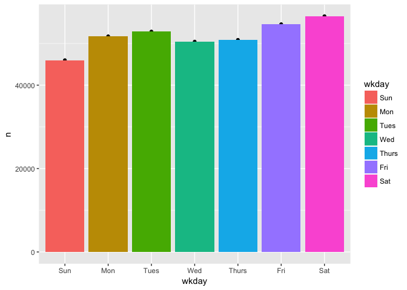
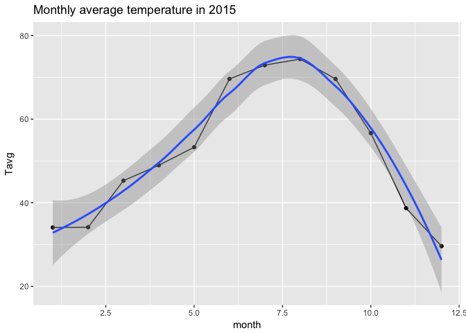

# How Does Weather Affect Denver Bcycle Usage?
Andy Pickering  
Aug 1, 2017  

## Introduction

This is an analysis looking at bike share ('BCycle') usage in Denver, CO, and the effect of weather. This was originally done in ?2016 . I am now (Aug 2017) re-visiting the analysis and updating code. I was just learning R at the time of the original analysis, so i'm updating and extending the analysis with my improved R skills. This project is maintained ina github repo at - <https://github.com/andypicke/Bcycle>
.

## Clear workspace and load libraries we'll use in the analysis

```r
rm(list=ls())
library(ggplot2)
suppressPackageStartupMessages(library(lubridate))
suppressPackageStartupMessages(library(dplyr))
```


## Bcycle Data

First read in the data for 2015, which I have downloaded already from <https://denver.bcycle.com/company>. Note: I tried to read in the xlsx file using the 'xlsx' package, but it didn't work. Instead I just opened excel and saved the file as a csv.


```r
bcyc<-read.csv("data/Bcyc2015.csv")
```


### Take a look at structure of the data
- dates/times are Factor type and need to be converted

```r
glimpse(bcyc)
```

```
## Observations: 363,002
## Variables: 12
## $ User.s.Program     <fctr> Denver B-cycle, Denver B-cycle, Denver B-c...
## $ User.ID            <int> 253201, 120679, 1027135, 986934, 130156, 10...
## $ Zip                <fctr> 80202, 80209, 60439, 80203, 80204, 80211, ...
## $ Membership.Type    <fctr> Annual (Denver B-cycle), Annual (Denver B-...
## $ Bike               <fctr> 212, 9, 322, 482, 466, 611, 210, 600, 180,...
## $ Checkout.Date      <fctr> 12/31/15, 12/31/15, 12/31/15, 12/31/15, 12...
## $ Checkout.Time      <fctr> 11:51:00 PM, 11:29:00 PM, 10:50:00 PM, 10:...
## $ Checkout.Kiosk     <fctr> 32nd & Pecos, 18th & Arapahoe, 16th & Broa...
## $ Return.Date        <fctr> 12/31/15, 12/31/15, 12/31/15, 12/31/15, 12...
## $ Return.Time        <fctr> 11:57:00 PM, 11:35:00 PM, 10:59:00 PM, 10:...
## $ Return.Kiosk       <fctr> 15th & Delgany, 25th & Lawrence, 17th & Ra...
## $ Duration..Minutes. <int> 6, 6, 9, 8, 10, 14, 4, 626, 3, 3, 23, 6, 3,...
```


### Modifications:
- make column names lowercase
- remove periods and spaces in column anmes
- shorten some names
- Convert dates/times to appropriate data types


```r
names(bcyc) <- names(bcyc) %>%
        tolower() %>%
        stringr::str_replace_all('[.]','_')

bcyc$checkout_date <- lubridate::as_date(as.character(bcyc$checkout_date),'%m/%d/%y')
bcyc$return_date   <- lubridate::as_date(as.character(bcyc$return_date),'%m/%d/%y')
bcyc$return_time   <- lubridate::parse_date_time(as.character(bcyc$return_time),'%I:%M:%S %p')
bcyc$checkout_time <- lubridate::parse_date_time(as.character(bcyc$checkout_time),'%I:%M:%S %p')

bcyc$month <- lubridate::month(bcyc$checkout_date)
bcyc$yday <- lubridate::yday(bcyc$checkout_date)
bcyc <- arrange(bcyc,checkout_date,checkout_time)


glimpse(bcyc)
```

```
## Observations: 363,002
## Variables: 14
## $ user_s_program     <fctr> Denver B-cycle, Denver B-cycle, Denver B-c...
## $ user_id            <int> 233037, 481799, 560257, 615015, 212129, 468...
## $ zip                <fctr> 80210, 80202, 80296, 80203, , 80205, 80215...
## $ membership_type    <fctr> Annual (Denver B-cycle), Annual (Denver B-...
## $ bike               <fctr> 361, 331, 43, 169, 900, 254, 187, 600, 361...
## $ checkout_date      <date> 2015-01-01, 2015-01-01, 2015-01-01, 2015-0...
## $ checkout_time      <dttm> 0000-01-01 06:24:00, 0000-01-01 07:48:00, ...
## $ checkout_kiosk     <fctr> 11th & Emerson, Market Street Station, 12t...
## $ return_date        <date> 2015-01-01, 2015-01-01, 2015-01-01, 2015-0...
## $ return_time        <dttm> 0000-01-01 06:38:00, 0000-01-01 07:52:00, ...
## $ return_kiosk       <fctr> 10th & Osage, REI, 3rd & Milwaukee, 1st & ...
## $ duration__minutes_ <int> 14, 4, 9, 16, 20, 4, 6, 12, 133, 13, 7, 26,...
## $ month              <dbl> 1, 1, 1, 1, 1, 1, 1, 1, 1, 1, 1, 1, 1, 1, 1...
## $ yday               <dbl> 1, 1, 1, 1, 1, 1, 1, 1, 1, 1, 1, 1, 1, 1, 1...
```


How many rides (rows) are contained in this dataset?

```r
nr<-nrow(bcyc)
nr
```

```
## [1] 363002
```


### How many missing values are there?


### Group by month and plot total # rides

```r
bcyc %>% group_by(month) %>%
        count() %>% 
        ggplot(aes(x=month,y=n)) +
        geom_point() + 
        geom_line() + 
        geom_smooth(method='loess') +
        xlab("Month") + ylab('# Rides') + 
        ggtitle("Monthly Number of Bcycle rides in 2015")
```

<!-- -->


### Group by yday and plot total # rides

```r
bcyc %>% group_by(yday) %>% 
        count() %>% 
        ggplot(aes(x=yday,y=n)) +
        geom_point() + 
        geom_smooth(method='loess') + 
        xlab("yday") + 
        ylab('# Rides') + 
        ggtitle("Daily Number of Bcycle rides in 2015")
```

<!-- -->


### Plot number rides by wkday

```r
bcyc$wkday <- lubridate::wday(bcyc$checkout_date,label=TRUE)
bcyc %>% 
        group_by(wkday) %>%
        count() %>%
        ggplot(aes(wkday,n))+
        geom_point() +
        geom_bar(stat='Identity',aes(fill=wkday))
```

<!-- -->

### Plot number rides by hour


```r
bcyc$hour <- hour(bcyc$checkout_time)
#head(bcyc)
bcyc %>% 
        group_by(hour) %>%
        count() %>%
        ggplot(aes(hour,n))+
        geom_point() +
        geom_bar(stat='Identity',aes(fill=hour)) +
        xlab('Hour of Day') +
        ylab('# Rides') +
        ggtitle("Total # rides per hour for all days in 2015")
```

<!-- -->


## Weather Data
So we can see that the total rides peaks around August, and is lowest around December. This is probably related to the weather, let's get some weather data and check this out. I'm using data downloaded from <https://www.wunderground.com>.


```r
# Daily weather data for 2015
url<-"https://www.wunderground.com/history/airport/KDEN/2015/1/1/CustomHistory.html?dayend=31&monthend=12&yearend=2015&req_city=&req_state=&req_statename=&reqdb.zip=&reqdb.magic=&reqdb.wmo=&format=1"

download.file(url,"DenWeather2015.csv")
wea<-read.csv("DenWeather2015.csv")

wea$MST <- as.Date(wea$MST,"%Y-%m-%d")
wea$month <- month(wea$MS)

# in Precip "T" is trace I think; change to zero for analysis
idT<-which(wea$PrecipitationIn=="T")
wea$PrecipitationIn[idT]<-"0.00"
wea$PrecipitationIn <- as.numeric(as.character(wea$PrecipitationIn))

glimpse(wea)
```

```
## Observations: 365
## Variables: 24
## $ MST                       <date> 2015-01-01, 2015-01-02, 2015-01-03,...
## $ Max.TemperatureF          <int> 26, 35, 35, 36, 56, 49, 39, 49, 29, ...
## $ Mean.TemperatureF         <int> 16, 23, 15, 13, 26, 35, 27, 34, 22, ...
## $ Min.TemperatureF          <int> 5, 11, -5, -10, -5, 20, 14, 19, 15, ...
## $ Max.Dew.PointF            <int> 19, 22, 25, 13, 34, 36, 25, 29, 24, ...
## $ MeanDew.PointF            <int> 9, 14, 11, 2, 20, 29, 15, 23, 18, 26...
## $ Min.DewpointF             <int> -8, 9, -7, -13, -6, 19, 11, 17, 13, ...
## $ Max.Humidity              <int> 92, 96, 92, 91, 95, 92, 96, 92, 100,...
## $ Mean.Humidity             <int> 67, 79, 77, 65, 67, 73, 83, 63, 91, ...
## $ Min.Humidity              <int> 42, 61, 61, 38, 38, 53, 69, 34, 81, ...
## $ Max.Sea.Level.PressureIn  <dbl> 30.22, 30.17, 30.40, 30.51, 30.53, 3...
## $ Mean.Sea.Level.PressureIn <dbl> 30.13, 30.02, 30.05, 30.42, 30.17, 3...
## $ Min.Sea.Level.PressureIn  <dbl> 29.99, 29.79, 29.79, 30.20, 29.99, 3...
## $ Max.VisibilityMiles       <int> 10, 10, 10, 10, 10, 10, 10, 10, 10, ...
## $ Mean.VisibilityMiles      <int> 6, 10, 6, 10, 9, 8, 6, 7, 6, 8, 10, ...
## $ Min.VisibilityMiles       <int> 0, 7, 0, 6, 4, 0, 1, 2, 0, 0, 7, 0, ...
## $ Max.Wind.SpeedMPH         <int> 15, 17, 32, 15, 37, 30, 22, 23, 16, ...
## $ Mean.Wind.SpeedMPH        <int> 8, 10, 12, 7, 15, 9, 8, 13, 5, 9, 8,...
## $ Max.Gust.SpeedMPH         <int> 18, 22, 37, 19, 46, 39, 26, 27, 20, ...
## $ PrecipitationIn           <dbl> 0.08, 0.00, 0.08, 0.00, 0.00, 0.00, ...
## $ CloudCover                <int> 5, 2, 6, 5, 5, 6, 7, 6, 7, 5, 7, 8, ...
## $ Events                    <fctr> Fog-Snow, , Fog-Snow, , , Fog-Snow,...
## $ WindDirDegrees.br...      <fctr> 230<br />, 203<br />, 47<br />, 221...
## $ month                     <dbl> 1, 1, 1, 1, 1, 1, 1, 1, 1, 1, 1, 1, ...
```


```r
names(wea) <- names(wea) %>%
        tolower() %>%
        stringr::str_replace_all('[.]','_')
wea <- wea %>%
        rename(max_temp=max_temperaturef,
               mean_temp=mean_temperaturef,
               min_temp=min_temperaturef,
               max_dew=max_dew_pointf,
               mean_dw=meandew_pointf,
               min_dew=min_dewpointf,
               wind_dir = winddirdegrees_br___)
glimpse(wea)
```

```
## Observations: 365
## Variables: 24
## $ mst                       <date> 2015-01-01, 2015-01-02, 2015-01-03,...
## $ max_temp                  <int> 26, 35, 35, 36, 56, 49, 39, 49, 29, ...
## $ mean_temp                 <int> 16, 23, 15, 13, 26, 35, 27, 34, 22, ...
## $ min_temp                  <int> 5, 11, -5, -10, -5, 20, 14, 19, 15, ...
## $ max_dew                   <int> 19, 22, 25, 13, 34, 36, 25, 29, 24, ...
## $ mean_dw                   <int> 9, 14, 11, 2, 20, 29, 15, 23, 18, 26...
## $ min_dew                   <int> -8, 9, -7, -13, -6, 19, 11, 17, 13, ...
## $ max_humidity              <int> 92, 96, 92, 91, 95, 92, 96, 92, 100,...
## $ mean_humidity             <int> 67, 79, 77, 65, 67, 73, 83, 63, 91, ...
## $ min_humidity              <int> 42, 61, 61, 38, 38, 53, 69, 34, 81, ...
## $ max_sea_level_pressurein  <dbl> 30.22, 30.17, 30.40, 30.51, 30.53, 3...
## $ mean_sea_level_pressurein <dbl> 30.13, 30.02, 30.05, 30.42, 30.17, 3...
## $ min_sea_level_pressurein  <dbl> 29.99, 29.79, 29.79, 30.20, 29.99, 3...
## $ max_visibilitymiles       <int> 10, 10, 10, 10, 10, 10, 10, 10, 10, ...
## $ mean_visibilitymiles      <int> 6, 10, 6, 10, 9, 8, 6, 7, 6, 8, 10, ...
## $ min_visibilitymiles       <int> 0, 7, 0, 6, 4, 0, 1, 2, 0, 0, 7, 0, ...
## $ max_wind_speedmph         <int> 15, 17, 32, 15, 37, 30, 22, 23, 16, ...
## $ mean_wind_speedmph        <int> 8, 10, 12, 7, 15, 9, 8, 13, 5, 9, 8,...
## $ max_gust_speedmph         <int> 18, 22, 37, 19, 46, 39, 26, 27, 20, ...
## $ precipitationin           <dbl> 0.08, 0.00, 0.08, 0.00, 0.00, 0.00, ...
## $ cloudcover                <int> 5, 2, 6, 5, 5, 6, 7, 6, 7, 5, 7, 8, ...
## $ events                    <fctr> Fog-Snow, , Fog-Snow, , , Fog-Snow,...
## $ wind_dir                  <fctr> 230<br />, 203<br />, 47<br />, 221...
## $ month                     <dbl> 1, 1, 1, 1, 1, 1, 1, 1, 1, 1, 1, 1, ...
```


```r
wea %>% group_by(month) %>% 
        summarise(Tavg = mean(mean_temp)) %>% 
        ggplot(aes(x=month,y=Tavg)) + 
        geom_point() + 
        geom_line() + 
        geom_smooth(method='loess') +
        ggtitle('Monthly average temperature in 2015')
```

<!-- -->


```r
wea %>% group_by(month) %>% 
        summarise(hum_avg = mean(mean_humidity)) %>% 
        ggplot(aes(x=month,y=hum_avg)) + 
        geom_point() + 
        geom_line() + 
        geom_smooth(method='loess') +
        ggtitle('Monthly average humidity in 2015')
```

<!-- -->


```r
wea %>% group_by(month) %>% 
        summarise(precip_avg = mean(precipitationin)) %>% 
        ggplot(aes(x=month,y=precip_avg)) + 
        geom_point() + 
        geom_line() + 
        geom_smooth(method='loess') +
        ggtitle('Monthly average precip in 2015')
```

<!-- -->


## Comparison of weather and Bcycle data 
- The MaxTemp seasonal cycle looks very similar to the month ride totals. Let's make some scatterplots to better see the correlation between weather variables and the number of rides.


### Monthly
- Make new data frames grouped by month


```r
bcyc_monthly <- bcyc %>% 
        group_by(month) %>% 
        count()

wea_monthly  <- wea %>% 
        group_by(month) %>% 
        summarise(tavg=mean(mean_temp,na.rm=TRUE),
        precip_avg=mean(precipitationin,na.rm=TRUE))

month_merge  <- merge(bcyc_monthly,wea_monthly) 

ggplot(month_merge,aes(x=tavg,y=n)) +
        geom_point() + 
        geom_smooth(method = "lm") +
        ylab(" # Rides/month ") +
        xlab(" Avg Temperature")
```

<!-- -->


```r
ggplot(month_merge,aes(x=precip_avg,y=n)) +
        geom_point() + 
        geom_smooth(method = "lm") +
        ylab(" # Rides/month ") +
        xlab(" Avg Temperature")
```

<!-- -->


### Daily


```r
bcyc$yday <- yday(bcyc$checkout_date)
wea$yday  <- yday(wea$mst)

bcyc %>% 
        group_by(yday) %>%
        count() %>% 
        ggplot(aes(yday,n)) + 
        geom_point() + 
        geom_smooth(method='loess') 
```

<!-- -->

```r
wea %>% 
        ggplot(aes(yday,mean_temp)) + 
        geom_point() + 
        geom_smooth(method='loess')
```

<!-- -->


At the daily level, the seasonal pattern is the same but there is a lot more variability, especially in the winter/spring.  
  

### Rides vs Temperature 

```r
bcyc_daily <- bcyc %>%
        group_by(yday) %>% 
        count()

yday_merge <- merge(bcyc_daily,wea) %>% 
        select(yday,n,mean_temp)

yday_merge %>% 
        ggplot(aes(mean_temp,n)) + 
        geom_point() +  
        geom_smooth(method='loess',col='red') + 
        geom_smooth(method = "lm") +
        xlab("Mean Temperature") +
        ylab("# Daily Rides") 
```

<!-- -->


<!-- ### Ride duration vs temperature. -->
<!-- - Plot ride duration vs temperature for each ride -->
<!-- ```{r Ride Durations for different temp ranges} -->
<!-- bcyc %>% -->
<!--         filter(yday<200) %>% -->
<!--         select(yday,duration__minutes_) %>% -->
<!--         left_join(wea) %>% -->
<!--         select(yday,duration__minutes_,mean_temp) %>% -->
<!--         ggplot(aes(mean_temp,duration__minutes_)) + -->
<!--         geom_point() + -->
<!--         geom_jitter() + -->
<!--         ylim(0,100) + -->
<!--         geom_smooth(method="lm") -->
<!-- ``` -->


## Conclusions:  
- The total number of Denver Bcycle rides has a strong seasonal cycle, peaking around August and minimum around January.  
- The total number of Denver Bcycle rides per month is strongly correlated with the monthly mean of max temperatures.  
- Below about 30 deg and above 80 deg, the number of rides is less dependent on further decreasing(increasing) temperature.  


##  Follow-up Questions:  
- Do all years look the same?  
- Does the relationship between weather and rides look different for different types of passes (ie annual vs 24 hour)?  
- Is there a stronger correlation with precip on shorter timescales (hourly?)?

